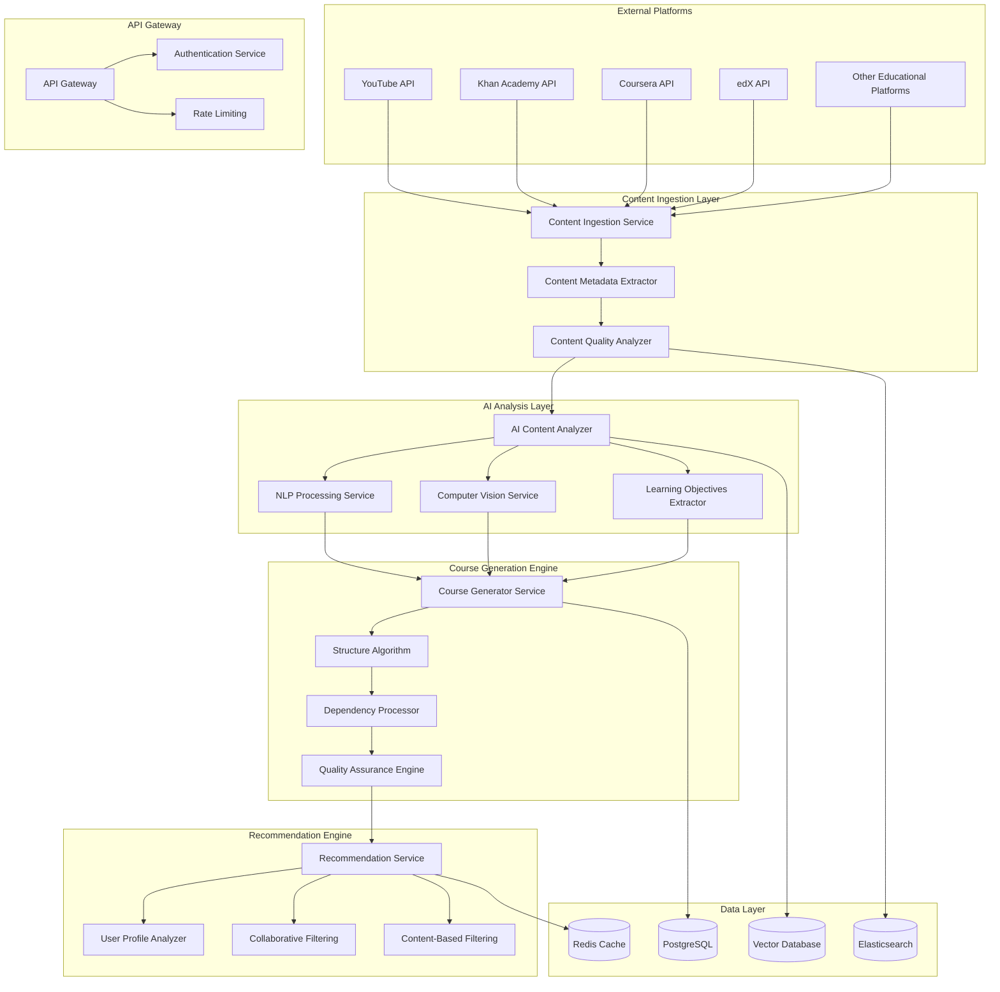

# Design Document

## Overview

The AI Course Generation System is a sophisticated microservice architecture that combines machine learning, content analysis, and educational pedagogy to automatically curate and generate structured learning courses from multiple educational platforms. The system ensures users receive coherent, progressive learning experiences rather than random content recommendations.

The architecture leverages AI for content analysis, algorithmic approaches for course structure generation, and real-time adaptation mechanisms to provide personalized, high-quality educational experiences across different age groups and skill levels.

## Architecture

### High-Level Architecture



### Microservices Architecture

The system is composed of several specialized microservices:

1. **Content Ingestion Service**: Handles API integrations with educational platforms
2. **AI Analysis Service**: Processes content using machine learning models
3. **Course Generation Service**: Creates structured courses from analyzed content
4. **Recommendation Service**: Provides personalized course recommendations
5. **Quality Assurance Service**: Validates content and course quality
6. **User Profile Service**: Manages user data and learning analytics
7. **Certification Service**: Handles course completion and certificates

## Components and Interfaces

### Content Ingestion Service

**Purpose**: Aggregate content from multiple educational platforms with unified metadata extraction.

**Key Components**:
- Platform Adapters (YouTube, Khan Academy, Coursera, edX)
- Content Normalizer
- Metadata Extractor
- Rate Limiting Manager

**Interfaces**:
```typescript
interface ContentIngestionService {
  ingestFromPlatform(platform: Platform, query: SearchQuery): Promise<RawContent[]>
  normalizeContent(rawContent: RawContent): Promise<NormalizedContent>
  extractMetadata(content: NormalizedContent): Promise<ContentMetadata>
  validateContentSource(source: ContentSource): Promise<ValidationResult>
}

interface ContentMetadata {
  id: string
  title: string
  description: string
  duration: number
  difficulty: DifficultyLevel
  subjects: Subject[]
  educationLevel: EducationLevel
  contentType: ContentType
  creator: CreatorInfo
  platform: Platform
  qualityScore: number
  learningObjectives: string[]
  prerequisites: string[]
}
```

### AI Analysis Service

**Purpose**: Analyze content using machine learning to extract educational value and structure.

**Key Components**:
- NLP Content Analyzer
- Computer Vision Processor
- Learning Objectives Extractor
- Educational Quality Scorer
- Content Classifier

**Interfaces**:
```typescript
interface AIAnalysisService {
  analyzeContent(content: NormalizedContent): Promise<ContentAnalysis>
  extractLearningObjectives(content: NormalizedContent): Promise<LearningObjective[]>
  assessEducationalQuality(content: NormalizedContent): Promise<QualityAssessment>
  classifyContent(content: NormalizedContent): Promise<ContentClassification>
  detectInappropriateContent(content: NormalizedContent): Promise<SafetyAssessment>
}

interface ContentAnalysis {
  educationalValue: number
  cognitiveLoad: number
  engagementLevel: number
  conceptComplexity: number
  prerequisiteKnowledge: string[]
  learningOutcomes: string[]
  keyTopics: Topic[]
  difficultyProgression: ProgressionCurve
}
```

### Course Generation Service

**Purpose**: Create structured, coherent courses from analyzed content with proper learning progression.

**Key Components**:
- Course Structure Algorithm
- Dependency Graph Builder
- Learning Path Optimizer
- Content Sequencer
- Gap Analyzer

**Interfaces**:
```typescript
interface CourseGenerationService {
  generateCourse(requirements: CourseRequirements): Promise<GeneratedCourse>
  optimizeLearningPath(content: AnalyzedContent[]): Promise<LearningPath>
  buildDependencyGraph(content: AnalyzedContent[]): Promise<DependencyGraph>
  fillContentGaps(course: PartialCourse): Promise<CompleteCourse>
  validateCourseStructure(course: GeneratedCourse): Promise<ValidationResult>
}

interface GeneratedCourse {
  id: string
  title: string
  description: string
  modules: CourseModule[]
  totalDuration: number
  difficulty: DifficultyLevel
  prerequisites: string[]
  learningObjectives: string[]
  assessments: Assessment[]
  completionCriteria: CompletionCriteria
  adaptationRules: AdaptationRule[]
}

interface CourseModule {
  id: string
  title: string
  description: string
  content: ContentItem[]
  exercises: Exercise[]
  assessment: Assessment
  estimatedDuration: number
  prerequisites: string[]
  learningObjectives: string[]
}
```

### Recommendation Service

**Purpose**: Provide personalized course recommendations based on user profiles and learning analytics.

**Key Components**:
- User Profile Analyzer
- Collaborative Filtering Engine
- Content-Based Filtering Engine
- Hybrid Recommendation Algorithm
- Real-time Adaptation Engine

**Interfaces**:
```typescript
interface RecommendationService {
  getPersonalizedRecommendations(userId: string, context: RecommendationContext): Promise<CourseRecommendation[]>
  updateUserProfile(userId: string, activity: LearningActivity): Promise<void>
  adaptCourseInRealTime(userId: string, courseId: string, performance: PerformanceData): Promise<CourseAdaptation>
  calculateRecommendationScore(user: UserProfile, course: GeneratedCourse): Promise<number>
}

interface CourseRecommendation {
  course: GeneratedCourse
  relevanceScore: number
  confidenceLevel: number
  reasoning: string[]
  estimatedCompletionTime: number
  successProbability: number
  adaptationPotential: number
}
```

## Data Models

### Core Data Models

```typescript
// User and Profile Models
interface UserProfile {
  id: string
  demographics: Demographics
  educationLevel: EducationLevel
  learningGoals: LearningGoal[]
  preferences: LearningPreferences
  skillAssessments: SkillAssessment[]
  learningHistory: LearningActivity[]
  performanceMetrics: PerformanceMetrics
}

interface LearningPreferences {
  contentTypes: ContentType[]
  learningPace: LearningPace
  difficultyPreference: DifficultyPreference
  timeAvailability: TimeAvailability
  languagePreferences: string[]
  accessibilityNeeds: AccessibilityRequirement[]
}

// Content Models
interface ContentItem {
  id: string
  metadata: ContentMetadata
  analysis: ContentAnalysis
  qualityMetrics: QualityMetrics
  userInteractions: UserInteraction[]
  platformData: PlatformSpecificData
}

interface QualityMetrics {
  overallScore: number
  educationalValue: number
  userSatisfaction: number
  completionRate: number
  effectivenessScore: number
  peerReviews: PeerReview[]
}

// Course Models
interface Course {
  id: string
  metadata: CourseMetadata
  structure: CourseStructure
  content: CourseContent
  assessments: Assessment[]
  analytics: CourseAnalytics
  adaptationHistory: AdaptationEvent[]
}

interface CourseStructure {
  modules: CourseModule[]
  dependencies: DependencyGraph
  progressionRules: ProgressionRule[]
  adaptationRules: AdaptationRule[]
  completionCriteria: CompletionCriteria
}
```

### Database Schema Design

**PostgreSQL Tables**:
- `users` - User profiles and authentication
- `courses` - Generated course metadata
- `course_modules` - Course module structure
- `content_items` - Individual content pieces
- `user_progress` - Learning progress tracking
- `recommendations` - Recommendation history
- `quality_metrics` - Content quality assessments
- `learning_analytics` - User learning data

**Vector Database (Pinecone/Weaviate)**:
- Content embeddings for similarity search
- User preference vectors
- Course structure embeddings
- Learning objective vectors

**Redis Cache**:
- User session data
- Recommendation cache
- Content metadata cache
- Real-time adaptation state

## Error Handling

### Error Categories and Handling Strategies

**Content Ingestion Errors**:
- API rate limiting: Implement exponential backoff and queue management
- Invalid content: Log, flag for review, and exclude from processing
- Platform unavailability: Use cached data and fallback mechanisms

**AI Analysis Errors**:
- Model inference failures: Retry with different models or use rule-based fallbacks
- Content processing errors: Queue for manual review and use default classifications
- Quality assessment failures: Apply conservative quality scores

**Course Generation Errors**:
- Insufficient content: Recommend alternative topics or suggest prerequisite courses
- Structure validation failures: Use template-based course structures
- Dependency resolution errors: Simplify course structure or split into multiple courses

**Recommendation Errors**:
- Cold start problem: Use demographic-based recommendations and popular courses
- Insufficient user data: Gradually collect preferences through implicit feedback
- Performance degradation: Fall back to simpler recommendation algorithms

### Error Recovery Mechanisms

```typescript
interface ErrorRecoveryService {
  handleContentIngestionError(error: IngestionError): Promise<RecoveryAction>
  handleAIAnalysisError(error: AnalysisError): Promise<RecoveryAction>
  handleCourseGenerationError(error: GenerationError): Promise<RecoveryAction>
  handleRecommendationError(error: RecommendationError): Promise<RecoveryAction>
}

enum RecoveryAction {
  RETRY_WITH_BACKOFF = 'retry_with_backoff',
  USE_FALLBACK_METHOD = 'use_fallback_method',
  QUEUE_FOR_MANUAL_REVIEW = 'queue_for_manual_review',
  USE_CACHED_RESULT = 'use_cached_result',
  NOTIFY_ADMINISTRATORS = 'notify_administrators'
}
```

## Testing Strategy

### Unit Testing
- **Content Analysis**: Test AI model outputs with known educational content
- **Course Generation**: Validate course structure algorithms with sample content
- **Recommendation Engine**: Test recommendation accuracy with synthetic user data
- **Quality Assurance**: Verify content validation rules and scoring algorithms

### Integration Testing
- **Platform APIs**: Test all external platform integrations with real API calls
- **Service Communication**: Verify microservice interactions and data flow
- **Database Operations**: Test data persistence and retrieval across all services
- **Cache Performance**: Validate Redis caching strategies and invalidation

### End-to-End Testing
- **Course Generation Pipeline**: Test complete flow from content ingestion to course delivery
- **User Journey**: Simulate user interactions from registration to course completion
- **Real-time Adaptation**: Test course modifications based on user performance
- **Multi-platform Content**: Verify course generation using content from multiple sources

### Performance Testing
- **Load Testing**: Simulate high concurrent user loads for recommendation requests
- **Content Processing**: Test AI analysis performance with large content volumes
- **Database Performance**: Validate query performance under realistic data loads
- **API Response Times**: Ensure sub-second response times for user-facing endpoints

### Quality Assurance Testing
- **Educational Content Validation**: Manual review of generated courses by education experts
- **Age-Appropriateness**: Test content filtering for different age groups
- **Accessibility Compliance**: Verify WCAG compliance for all generated content
- **Multi-language Support**: Test course generation in multiple languages

### Monitoring and Observability

**Key Metrics**:
- Course completion rates by generated course type
- User satisfaction scores for AI-generated vs. manually curated courses
- Content quality scores and their correlation with user outcomes
- Recommendation accuracy and click-through rates
- System performance metrics (latency, throughput, error rates)

**Alerting**:
- Content quality scores below threshold
- High error rates in course generation
- Unusual patterns in user behavior or course performance
- External API failures or rate limiting issues

**Dashboards**:
- Real-time course generation pipeline status
- User engagement and learning outcome metrics
- Content source performance and quality trends
- System health and performance indicators