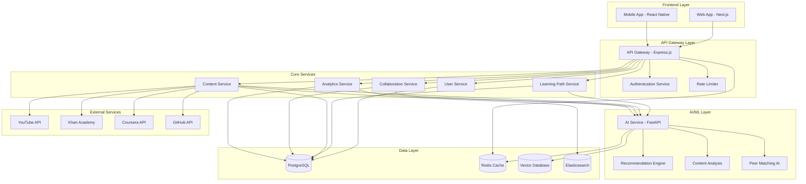

# Core Learning Architecture Design

## Overview

The core learning architecture is designed as a microservices-based system that orchestrates personalized learning experiences through AI-powered analytics, content recommendations, and peer collaboration. The architecture follows domain-driven design principles with clear service boundaries, ensuring scalability, maintainability, and fault tolerance.

The system serves as the central nervous system of our AI-enhanced learning platform, coordinating between user profiles, content sources, AI services, and collaboration tools to deliver adaptive, personalized learning experiences across K-12, college, and professional education levels.

## Architecture

### High-Level System Architecture



### Service Architecture Pattern

The system follows a **Domain-Driven Microservices** pattern with:

- **API Gateway**: Single entry point with authentication, rate limiting, and request routing
- **Domain Services**: Each service owns its data and business logic
- **AI/ML Service**: Centralized AI processing with specialized models
- **Event-Driven Communication**: Asynchronous communication between services
- **CQRS Pattern**: Separate read/write models for analytics and reporting

## Components and Interfaces

### 1. User Service

**Responsibilities:**
- User profile management and authentication
- Learning preferences and goal tracking
- Privacy settings and parental controls
- User assessment and skill profiling

**Key Interfaces:**
```typescript
interface UserProfile {
  id: string;
  demographics: UserDemographics;
  educationLevel: EducationLevel;
  learningPreferences: LearningPreferences;
  skillProfile: SkillAssessment[];
  privacySettings: PrivacySettings;
  parentalControls?: ParentalControls;
}

interface UserService {
  createProfile(userData: CreateUserRequest): Promise<UserProfile>;
  updatePreferences(userId: string, preferences: LearningPreferences): Promise<void>;
  assessSkills(userId: string, assessment: SkillAssessment): Promise<SkillProfile>;
  getProfile(userId: string): Promise<UserProfile>;
}
```

### 2. Learning Path Service

**Responsibilities:**
- Personalized learning path generation
- Progress tracking and adaptation
- Difficulty adjustment algorithms
- Learning objective management

**Key Interfaces:**
```typescript
interface LearningPath {
  id: string;
  userId: string;
  subject: string;
  currentLevel: DifficultyLevel;
  objectives: LearningObjective[];
  milestones: Milestone[];
  adaptationHistory: PathAdaptation[];
}

interface LearningPathService {
  generatePath(userId: string, subject: string, goals: LearningGoal[]): Promise<LearningPath>;
  updateProgress(userId: string, sessionData: LearningSession): Promise<LearningPath>;
  adaptDifficulty(pathId: string, performanceMetrics: PerformanceData): Promise<void>;
  getNextContent(pathId: string): Promise<ContentRecommendation[]>;
}
```

### 3. Content Service

**Responsibilities:**
- Multi-source content aggregation
- Content metadata management
- Quality scoring and filtering
- Age-appropriate content validation

**Key Interfaces:**
```typescript
interface ContentItem {
  id: string;
  source: ContentSource;
  url: string;
  metadata: ContentMetadata;
  qualityScore: number;
  ageRating: AgeRating;
  learningObjectives: string[];
  embeddings: number[];
}

interface ContentService {
  searchContent(query: ContentQuery): Promise<ContentItem[]>;
  aggregateFromSources(): Promise<void>;
  validateContent(contentId: string): Promise<ValidationResult>;
  updateMetadata(contentId: string, metadata: ContentMetadata): Promise<void>;
}
```

### 4. AI Service (Python/FastAPI)

**Responsibilities:**
- Learning analytics and pattern recognition
- Content recommendation algorithms
- Peer matching intelligence
- Natural language processing for content analysis

**Key Interfaces:**
```python
class AIService:
    async def generate_learning_path(
        self, 
        user_profile: UserProfile, 
        learning_goals: List[LearningGoal]
    ) -> LearningPath:
        """Generate personalized learning path using ML models"""
        
    async def recommend_content(
        self, 
        user_id: str, 
        current_topic: str, 
        context: LearningContext
    ) -> List[ContentRecommendation]:
        """Recommend content using vector similarity and collaborative filtering"""
        
    async def match_peers(
        self, 
        user_profile: UserProfile, 
        preferences: CollaborationPreferences
    ) -> List[PeerMatch]:
        """Find compatible learning partners using ML matching algorithms"""
        
    async def analyze_learning_patterns(
        self, 
        user_sessions: List[LearningSession]
    ) -> LearningInsights:
        """Analyze learning patterns and provide insights"""
```

### 5. Collaboration Service

**Responsibilities:**
- Peer matching and group formation
- Real-time collaboration features
- Safety monitoring and moderation
- Communication facilitation

**Key Interfaces:**
```typescript
interface CollaborationService {
  matchPeers(userId: string, criteria: MatchingCriteria): Promise<PeerMatch[]>;
  createStudyGroup(participants: string[], topic: string): Promise<StudyGroup>;
  moderateInteraction(interactionId: string): Promise<ModerationResult>;
  facilitateSession(sessionId: string): Promise<CollaborationSession>;
}
```

## Data Models

### Core Domain Models

```typescript
// User Domain
interface UserProfile {
  id: string;
  email: string;
  demographics: {
    ageRange: AgeRange;
    educationLevel: EducationLevel;
    timezone: string;
    preferredLanguage: string;
  };
  learningPreferences: {
    learningStyle: LearningStyle[];
    preferredContentTypes: ContentType[];
    sessionDuration: number;
    difficultyPreference: DifficultyPreference;
  };
  skillProfile: SkillAssessment[];
  privacySettings: PrivacySettings;
  createdAt: Date;
  updatedAt: Date;
}

// Learning Domain
interface LearningPath {
  id: string;
  userId: string;
  subject: string;
  currentLevel: DifficultyLevel;
  objectives: LearningObjective[];
  progress: {
    completedObjectives: string[];
    currentMilestone: string;
    overallProgress: number;
    estimatedCompletion: Date;
  };
  adaptationHistory: PathAdaptation[];
  createdAt: Date;
  updatedAt: Date;
}

interface LearningSession {
  id: string;
  userId: string;
  pathId: string;
  contentItems: string[];
  duration: number;
  interactions: UserInteraction[];
  assessmentResults: AssessmentResult[];
  comprehensionScore: number;
  engagementMetrics: EngagementMetrics;
  timestamp: Date;
}

// Content Domain
interface ContentItem {
  id: string;
  source: ContentSource;
  externalId: string;
  url: string;
  title: string;
  description: string;
  metadata: {
    duration: number;
    difficulty: DifficultyLevel;
    subject: string;
    topics: string[];
    format: ContentFormat;
    language: string;
  };
  qualityMetrics: {
    userRating: number;
    completionRate: number;
    effectivenessScore: number;
    lastUpdated: Date;
  };
  ageRating: AgeRating;
  embeddings: number[];
  createdAt: Date;
  updatedAt: Date;
}

// Collaboration Domain
interface StudyGroup {
  id: string;
  name: string;
  topic: string;
  participants: GroupParticipant[];
  settings: {
    maxSize: number;
    ageRestrictions: AgeRange;
    moderationLevel: ModerationLevel;
    privacy: PrivacyLevel;
  };
  activities: CollaborationActivity[];
  createdAt: Date;
  updatedAt: Date;
}
```

### Database Schema Design

**PostgreSQL Tables:**
- `users` - User profiles and authentication
- `learning_paths` - Personalized learning journeys
- `learning_sessions` - Individual learning activities
- `content_items` - Aggregated educational content
- `study_groups` - Collaboration groups
- `peer_matches` - Peer relationship data
- `assessments` - Skill assessments and results
- `user_interactions` - Detailed interaction logs

**Vector Database (Pinecone/Weaviate):**
- Content embeddings for similarity search
- User preference vectors
- Learning pattern embeddings

**Redis Cache:**
- Session data and temporary state
- Real-time collaboration data
- Frequently accessed recommendations

## Error Handling

### Service-Level Error Handling

```typescript
class LearningPathError extends Error {
  constructor(
    message: string,
    public code: string,
    public userId?: string,
    public pathId?: string
  ) {
    super(message);
    this.name = 'LearningPathError';
  }
}

// Error handling middleware
const errorHandler = (error: Error, req: Request, res: Response, next: NextFunction) => {
  if (error instanceof LearningPathError) {
    logger.error('Learning path error', { 
      error: error.message, 
      code: error.code,
      userId: error.userId 
    });
    return res.status(400).json({
      error: 'Learning path generation failed',
      code: error.code,
      message: error.message
    });
  }
  
  // Handle AI service failures with fallbacks
  if (error.message.includes('AI_SERVICE_UNAVAILABLE')) {
    return res.status(200).json({
      data: await getFallbackRecommendations(req.params.userId),
      warning: 'Using cached recommendations due to service unavailability'
    });
  }
  
  next(error);
};
```

### AI Service Fallback Mechanisms

```python
class AIServiceFallback:
    async def get_fallback_learning_path(self, user_profile: UserProfile) -> LearningPath:
        """Provide static learning path when AI service fails"""
        education_level = user_profile.demographics.education_level
        
        if education_level == EducationLevel.K12:
            return self.get_k12_default_path(user_profile.subject_interests)
        elif education_level == EducationLevel.COLLEGE:
            return self.get_college_default_path(user_profile.major)
        else:
            return self.get_professional_default_path(user_profile.career_goals)
    
    async def get_cached_recommendations(self, user_id: str) -> List[ContentRecommendation]:
        """Return previously successful recommendations from cache"""
        cached_recs = await self.redis_client.get(f"recommendations:{user_id}")
        if cached_recs:
            return json.loads(cached_recs)
        return self.get_popular_content_by_level(user_id)
```

## Testing Strategy

### Unit Testing Approach

**Service Layer Testing:**
```typescript
describe('LearningPathService', () => {
  let service: LearningPathService;
  let mockAIService: jest.Mocked<AIService>;
  let mockUserRepository: jest.Mocked<UserRepository>;

  beforeEach(() => {
    mockAIService = createMockAIService();
    mockUserRepository = createMockUserRepository();
    service = new LearningPathService(mockAIService, mockUserRepository);
  });

  describe('generatePath', () => {
    it('should generate personalized learning path for K-12 student', async () => {
      // Arrange
      const userId = 'user-123';
      const subject = 'mathematics';
      const goals = [{ objective: 'master-algebra', timeline: '3-months' }];
      
      mockUserRepository.findById.mockResolvedValue(createK12UserProfile());
      mockAIService.generateLearningPath.mockResolvedValue(createMockLearningPath());

      // Act
      const result = await service.generatePath(userId, subject, goals);

      // Assert
      expect(result).toBeDefined();
      expect(result.subject).toBe(subject);
      expect(result.objectives).toHaveLength(5);
      expect(mockAIService.generateLearningPath).toHaveBeenCalledWith(
        expect.objectContaining({ id: userId }),
        goals
      );
    });

    it('should handle AI service failure with fallback', async () => {
      // Arrange
      mockAIService.generateLearningPath.mockRejectedValue(new Error('AI_SERVICE_UNAVAILABLE'));
      
      // Act
      const result = await service.generatePath('user-123', 'mathematics', []);

      // Assert
      expect(result).toBeDefined();
      expect(result.source).toBe('fallback');
    });
  });
});
```

**AI Service Testing (Python):**
```python
import pytest
from unittest.mock import AsyncMock, patch
from ai_service.services.recommendation_service import RecommendationService

class TestRecommendationService:
    @pytest.fixture
    def service(self):
        return RecommendationService()
    
    @pytest.mark.asyncio
    async def test_recommend_content_for_beginner(self, service):
        # Arrange
        user_profile = create_beginner_profile()
        topic = "python-basics"
        
        with patch.object(service.vector_db, 'similarity_search') as mock_search:
            mock_search.return_value = create_mock_content_results()
            
            # Act
            recommendations = await service.recommend_content(
                user_profile.id, topic, LearningContext.SELF_PACED
            )
            
            # Assert
            assert len(recommendations) >= 5
            assert all(rec.difficulty_level <= DifficultyLevel.BEGINNER 
                      for rec in recommendations)
            assert all(rec.age_appropriate for rec in recommendations)
```

### Integration Testing

**API Integration Tests:**
```typescript
describe('Learning Path API Integration', () => {
  let app: Express;
  let testDb: TestDatabase;

  beforeAll(async () => {
    testDb = await setupTestDatabase();
    app = createTestApp(testDb);
  });

  afterAll(async () => {
    await testDb.cleanup();
  });

  it('should create and retrieve learning path end-to-end', async () => {
    // Create user
    const user = await testDb.createUser(createTestUserData());
    
    // Generate learning path
    const response = await request(app)
      .post(`/api/v1/users/${user.id}/learning-paths`)
      .send({
        subject: 'javascript',
        goals: [{ objective: 'learn-react', timeline: '2-months' }]
      })
      .expect(201);

    expect(response.body.data.subject).toBe('javascript');
    expect(response.body.data.objectives).toBeDefined();

    // Verify path was stored
    const storedPath = await testDb.findLearningPath(response.body.data.id);
    expect(storedPath).toBeDefined();
  });
});
```

### End-to-End Testing

**Critical User Journey Tests:**
```typescript
// Using Playwright for E2E testing
test('Complete learning session flow', async ({ page }) => {
  // Login as K-12 student
  await page.goto('/login');
  await page.fill('[data-testid=email]', 'student@test.com');
  await page.fill('[data-testid=password]', 'password123');
  await page.click('[data-testid=login-button]');

  // Navigate to learning dashboard
  await page.waitForURL('/dashboard');
  expect(await page.textContent('[data-testid=welcome-message]'))
    .toContain('Welcome back');

  // Start a learning session
  await page.click('[data-testid=continue-learning]');
  await page.waitForURL('/learn/**');

  // Complete content interaction
  await page.click('[data-testid=content-item]');
  await page.waitForTimeout(5000); // Simulate content consumption
  await page.click('[data-testid=mark-complete]');

  // Verify progress update
  await page.goto('/dashboard');
  const progressBar = page.locator('[data-testid=progress-bar]');
  expect(await progressBar.getAttribute('aria-valuenow')).not.toBe('0');
});
```

This comprehensive design provides a solid foundation for building our AI-enhanced learning platform with proper separation of concerns, scalability considerations, and robust error handling mechanisms.