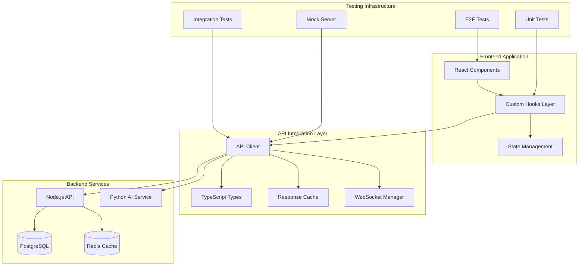

# Frontend API Integrations and Testing Design

## Overview

This design document outlines the architecture for a comprehensive frontend API integration layer and testing infrastructure for the LusiLearn AI platform. The solution builds upon the existing API integration foundation while adding robust testing, enhanced error handling, performance optimization, and developer experience improvements.

The design follows a layered architecture approach with clear separation of concerns, ensuring maintainability, testability, and scalability. The system will provide type-safe API interactions, comprehensive error handling, real-time communication capabilities, and extensive automated testing coverage.

## Architecture

### High-Level Architecture



### Layer Responsibilities

1. **React Components Layer**: UI components that consume API data through custom hooks
2. **Custom Hooks Layer**: Business logic and state management for API interactions
3. **API Client Layer**: Low-level HTTP client with authentication, caching, and error handling
4. **Type Safety Layer**: TypeScript interfaces and runtime validation
5. **Testing Layer**: Comprehensive test coverage across all integration points

## Components and Interfaces

### 1. Enhanced API Client

The core API client will be enhanced with additional capabilities:

```typescript
interface ApiClientConfig {
  baseURL: string;
  timeout: number;
  retryAttempts: number;
  retryDelay: number;
  cacheEnabled: boolean;
  cacheTTL: number;
  enableMetrics: boolean;
}

interface ApiClient {
  // Core HTTP methods
  get<T>(endpoint: string, options?: RequestOptions): Promise<ApiResponse<T>>;
  post<T>(endpoint: string, data?: any, options?: RequestOptions): Promise<ApiResponse<T>>;
  put<T>(endpoint: string, data?: any, options?: RequestOptions): Promise<ApiResponse<T>>;
  delete<T>(endpoint: string, options?: RequestOptions): Promise<ApiResponse<T>>;
  
  // Advanced features
  batch<T>(requests: BatchRequest[]): Promise<BatchResponse<T>>;
  upload(endpoint: string, file: File, options?: UploadOptions): Promise<ApiResponse<any>>;
  stream(endpoint: string, options?: StreamOptions): ReadableStream;
  
  // Configuration
  setAuthToken(token: string): void;
  clearCache(pattern?: string): void;
  getMetrics(): ApiMetrics;
}

interface RequestOptions {
  timeout?: number;
  retries?: number;
  cache?: boolean;
  cacheTTL?: number;
  signal?: AbortSignal;
  onProgress?: (progress: number) => void;
}

interface ApiResponse<T> {
  success: boolean;
  data?: T;
  message?: string;
  error?: string;
  metadata?: {
    requestId: string;
    timestamp: string;
    duration: number;
    cached: boolean;
  };
}
```

### 2. Enhanced Hook Architecture

Custom hooks will follow a consistent pattern with enhanced capabilities:

```typescript
interface BaseHookState<T> {
  data: T | null;
  loading: boolean;
  error: string | null;
  lastFetch: Date | null;
  isStale: boolean;
}

interface BaseHookActions {
  clearError: () => void;
  clearData: () => void;
  refresh: () => Promise<void>;
  invalidate: () => void;
}

interface HookOptions {
  autoFetch?: boolean;
  cacheTime?: number;
  staleTime?: number;
  refetchOnWindowFocus?: boolean;
  refetchOnReconnect?: boolean;
  onSuccess?: (data: any) => void;
  onError?: (error: string) => void;
}

// Example enhanced hook interface
interface UseLearningPathsReturn extends BaseHookState<LearningPath[]>, BaseHookActions {
  // Data
  learningPaths: LearningPath[];
  currentPath: LearningPath | null;
  
  // Computed
  hasLearningPaths: boolean;
  totalPaths: number;
  completedPaths: number;
  
  // Actions
  fetchLearningPaths: () => Promise<void>;
  fetchLearningPath: (id: string) => Promise<LearningPath | null>;
  createLearningPath: (data: CreateLearningPathRequest) => Promise<LearningPath | null>;
  updateLearningPath: (id: string, data: UpdateLearningPathRequest) => Promise<LearningPath | null>;
  deleteLearningPath: (id: string) => Promise<boolean>;
  shareLearningPath: (id: string, shareData: ShareRequest) => Promise<boolean>;
  
  // Optimistic updates
  optimisticUpdate: (id: string, data: Partial<LearningPath>) => void;
  rollbackOptimisticUpdate: (id: string) => void;
}
```

### 3. Real-time Communication Manager

WebSocket integration for real-time features:

```typescript
interface WebSocketManager {
  connect(url: string, options?: WSOptions): Promise<void>;
  disconnect(): void;
  subscribe(channel: string, callback: (data: any) => void): () => void;
  unsubscribe(channel: string): void;
  send(channel: string, data: any): void;
  getConnectionState(): 'connecting' | 'connected' | 'disconnected' | 'error';
}

interface WSOptions {
  autoReconnect?: boolean;
  reconnectInterval?: number;
  maxReconnectAttempts?: number;
  heartbeatInterval?: number;
  onConnect?: () => void;
  onDisconnect?: () => void;
  onError?: (error: Error) => void;
}

// Real-time hook example
interface UseRealTimeCollaboration {
  isConnected: boolean;
  participants: Participant[];
  messages: Message[];
  
  sendMessage: (message: string) => void;
  joinSession: (sessionId: string) => void;
  leaveSession: () => void;
  shareScreen: () => Promise<void>;
}
```

### 4. Caching and State Management

Intelligent caching system with multiple strategies:

```typescript
interface CacheManager {
  get<T>(key: string): T | null;
  set<T>(key: string, data: T, ttl?: number): void;
  invalidate(pattern: string): void;
  clear(): void;
  getStats(): CacheStats;
}

interface CacheStrategy {
  type: 'memory' | 'localStorage' | 'sessionStorage' | 'indexedDB';
  maxSize: number;
  ttl: number;
  evictionPolicy: 'lru' | 'fifo' | 'ttl';
}

interface StateManager {
  // Global state for shared data
  getGlobalState<T>(key: string): T | null;
  setGlobalState<T>(key: string, data: T): void;
  subscribeToState<T>(key: string, callback: (data: T) => void): () => void;
  
  // Optimistic updates
  applyOptimisticUpdate<T>(key: string, update: Partial<T>): void;
  rollbackOptimisticUpdate(key: string): void;
  confirmOptimisticUpdate(key: string): void;
}
```

## Data Models

### 1. Enhanced Type Definitions

Building on existing types with additional metadata and validation:

```typescript
// Enhanced API response with metadata
interface EnhancedApiResponse<T> extends ApiResponse<T> {
  metadata: {
    requestId: string;
    timestamp: string;
    duration: number;
    cached: boolean;
    retryCount: number;
    source: 'api' | 'cache' | 'optimistic';
  };
  pagination?: {
    page: number;
    limit: number;
    total: number;
    hasNext: boolean;
    hasPrev: boolean;
  };
}

// Request tracking for debugging
interface RequestMetadata {
  id: string;
  endpoint: string;
  method: string;
  timestamp: Date;
  duration?: number;
  status?: number;
  error?: string;
  retryCount: number;
  cached: boolean;
}

// Performance metrics
interface ApiMetrics {
  totalRequests: number;
  successfulRequests: number;
  failedRequests: number;
  averageResponseTime: number;
  cacheHitRate: number;
  errorsByType: Record<string, number>;
  slowestEndpoints: Array<{
    endpoint: string;
    averageTime: number;
  }>;
}
```

### 2. Validation Schemas

Runtime validation using Zod schemas:

```typescript
import { z } from 'zod';

// Schema definitions for runtime validation
const LearningPathSchema = z.object({
  id: z.string().uuid(),
  subject: z.string().min(1),
  currentLevel: z.string(),
  objectives: z.array(z.string()),
  milestones: z.array(MilestoneSchema),
  createdAt: z.string().datetime(),
  updatedAt: z.string().datetime(),
});

const ApiResponseSchema = <T>(dataSchema: z.ZodSchema<T>) => z.object({
  success: z.boolean(),
  data: dataSchema.optional(),
  message: z.string().optional(),
  error: z.string().optional(),
  metadata: z.object({
    requestId: z.string(),
    timestamp: z.string(),
    duration: z.number(),
    cached: z.boolean(),
  }).optional(),
});

// Validation utilities
interface ValidationResult<T> {
  success: boolean;
  data?: T;
  errors?: string[];
}

function validateApiResponse<T>(
  response: unknown,
  schema: z.ZodSchema<T>
): ValidationResult<T> {
  try {
    const validated = schema.parse(response);
    return { success: true, data: validated };
  } catch (error) {
    if (error instanceof z.ZodError) {
      return {
        success: false,
        errors: error.errors.map(e => `${e.path.join('.')}: ${e.message}`)
      };
    }
    return { success: false, errors: ['Unknown validation error'] };
  }
}
```

## Error Handling

### 1. Error Classification and Recovery

Comprehensive error handling with automatic recovery strategies:

```typescript
enum ErrorType {
  NETWORK = 'network',
  AUTHENTICATION = 'authentication',
  AUTHORIZATION = 'authorization',
  VALIDATION = 'validation',
  SERVER = 'server',
  TIMEOUT = 'timeout',
  RATE_LIMIT = 'rate_limit',
  UNKNOWN = 'unknown'
}

interface ApiError {
  type: ErrorType;
  message: string;
  code?: string;
  status?: number;
  details?: any;
  timestamp: Date;
  requestId?: string;
  recoverable: boolean;
  retryAfter?: number;
}

interface ErrorRecoveryStrategy {
  canRecover(error: ApiError): boolean;
  recover(error: ApiError, context: RequestContext): Promise<boolean>;
  getRetryDelay(attempt: number): number;
  maxRetries: number;
}

class NetworkErrorRecovery implements ErrorRecoveryStrategy {
  canRecover(error: ApiError): boolean {
    return error.type === ErrorType.NETWORK || error.type === ErrorType.TIMEOUT;
  }
  
  async recover(error: ApiError, context: RequestContext): Promise<boolean> {
    // Implement exponential backoff retry logic
    await new Promise(resolve => setTimeout(resolve, this.getRetryDelay(context.retryCount)));
    return true;
  }
  
  getRetryDelay(attempt: number): number {
    return Math.min(1000 * Math.pow(2, attempt), 30000);
  }
  
  maxRetries = 3;
}

class AuthenticationErrorRecovery implements ErrorRecoveryStrategy {
  canRecover(error: ApiError): boolean {
    return error.type === ErrorType.AUTHENTICATION;
  }
  
  async recover(error: ApiError, context: RequestContext): Promise<boolean> {
    try {
      await this.refreshToken();
      return true;
    } catch {
      this.redirectToLogin();
      return false;
    }
  }
  
  private async refreshToken(): Promise<void> {
    // Token refresh logic
  }
  
  private redirectToLogin(): void {
    // Redirect to login page
  }
  
  getRetryDelay(): number { return 0; }
  maxRetries = 1;
}
```

### 2. User-Friendly Error Messages

Error message mapping for better user experience:

```typescript
interface ErrorMessageConfig {
  [key: string]: {
    title: string;
    message: string;
    action?: string;
    severity: 'info' | 'warning' | 'error';
  };
}

const errorMessages: ErrorMessageConfig = {
  'NETWORK_ERROR': {
    title: 'Connection Problem',
    message: 'Unable to connect to the server. Please check your internet connection.',
    action: 'Retry',
    severity: 'error'
  },
  'AUTHENTICATION_FAILED': {
    title: 'Session Expired',
    message: 'Your session has expired. Please log in again.',
    action: 'Log In',
    severity: 'warning'
  },
  'VALIDATION_ERROR': {
    title: 'Invalid Data',
    message: 'Please check your input and try again.',
    severity: 'warning'
  },
  'RATE_LIMIT_EXCEEDED': {
    title: 'Too Many Requests',
    message: 'You\'re making requests too quickly. Please wait a moment.',
    severity: 'info'
  }
};

function getUserFriendlyError(error: ApiError): ErrorMessageConfig[string] {
  const key = `${error.type.toUpperCase()}_${error.code || 'ERROR'}`;
  return errorMessages[key] || errorMessages['UNKNOWN_ERROR'];
}
```

## Testing Strategy

### 1. Testing Architecture

Multi-layered testing approach with different test types:

```typescript
// Test configuration
interface TestConfig {
  apiBaseUrl: string;
  mockServerPort: number;
  testTimeout: number;
  retryAttempts: number;
  parallelTests: boolean;
  coverage: {
    threshold: number;
    includePatterns: string[];
    excludePatterns: string[];
  };
}

// Mock server setup
interface MockServer {
  start(port: number): Promise<void>;
  stop(): Promise<void>;
  addRoute(method: string, path: string, response: any): void;
  addDelay(path: string, delay: number): void;
  addError(path: string, error: ApiError): void;
  reset(): void;
  getRequestHistory(): RequestLog[];
}

// Test utilities
interface TestUtils {
  createMockUser(): UserProfile;
  createMockLearningPath(): LearningPath;
  setupAuthenticatedUser(): Promise<string>;
  cleanupTestData(): Promise<void>;
  waitForApiCall(endpoint: string, timeout?: number): Promise<RequestLog>;
  mockApiResponse<T>(endpoint: string, response: T): void;
}
```

### 2. Unit Testing for Hooks

Comprehensive hook testing with React Testing Library:

```typescript
// Hook testing utilities
interface HookTestUtils {
  renderHook<T>(hook: () => T, options?: RenderHookOptions): RenderHookResult<T>;
  waitForNextUpdate(): Promise<void>;
  mockApiCall(endpoint: string, response: any): void;
  mockApiError(endpoint: string, error: ApiError): void;
  verifyApiCall(endpoint: string, expectedData?: any): void;
}

// Example hook test
describe('useLearningPaths', () => {
  let mockServer: MockServer;
  let testUtils: HookTestUtils;
  
  beforeEach(async () => {
    mockServer = new MockServer();
    await mockServer.start(3001);
    testUtils = new HookTestUtils();
  });
  
  afterEach(async () => {
    await mockServer.stop();
    testUtils.cleanup();
  });
  
  it('should fetch learning paths successfully', async () => {
    const mockPaths = [testUtils.createMockLearningPath()];
    mockServer.addRoute('GET', '/api/v1/learning-paths', {
      success: true,
      data: mockPaths
    });
    
    const { result, waitForNextUpdate } = testUtils.renderHook(() => useLearningPaths());
    
    act(() => {
      result.current.fetchLearningPaths();
    });
    
    await waitForNextUpdate();
    
    expect(result.current.loading).toBe(false);
    expect(result.current.error).toBe(null);
    expect(result.current.learningPaths).toEqual(mockPaths);
  });
  
  it('should handle network errors gracefully', async () => {
    mockServer.addError('/api/v1/learning-paths', {
      type: ErrorType.NETWORK,
      message: 'Network error',
      recoverable: true
    });
    
    const { result, waitForNextUpdate } = testUtils.renderHook(() => useLearningPaths());
    
    act(() => {
      result.current.fetchLearningPaths();
    });
    
    await waitForNextUpdate();
    
    expect(result.current.loading).toBe(false);
    expect(result.current.error).toBe('Unable to connect to the server. Please check your internet connection.');
    expect(result.current.learningPaths).toEqual([]);
  });
});
```

### 3. Integration Testing

API integration tests with real backend services:

```typescript
// Integration test setup
interface IntegrationTestSetup {
  setupTestDatabase(): Promise<void>;
  seedTestData(): Promise<void>;
  cleanupTestData(): Promise<void>;
  createTestUser(): Promise<UserProfile>;
  authenticateTestUser(user: UserProfile): Promise<string>;
}

describe('Learning Paths API Integration', () => {
  let setup: IntegrationTestSetup;
  let testUser: UserProfile;
  let authToken: string;
  
  beforeAll(async () => {
    setup = new IntegrationTestSetup();
    await setup.setupTestDatabase();
    await setup.seedTestData();
    testUser = await setup.createTestUser();
    authToken = await setup.authenticateTestUser(testUser);
  });
  
  afterAll(async () => {
    await setup.cleanupTestData();
  });
  
  it('should create, read, update, and delete learning paths', async () => {
    // Create
    const createData: CreateLearningPathRequest = {
      subject: 'Mathematics',
      goals: ['Master calculus', 'Understand linear algebra']
    };
    
    const createResponse = await learningPathApi.create(createData);
    expect(createResponse.success).toBe(true);
    expect(createResponse.data).toBeDefined();
    
    const pathId = createResponse.data!.id;
    
    // Read
    const readResponse = await learningPathApi.getById(pathId);
    expect(readResponse.success).toBe(true);
    expect(readResponse.data?.subject).toBe('Mathematics');
    
    // Update
    const updateData: UpdateLearningPathRequest = {
      subject: 'Advanced Mathematics'
    };
    
    const updateResponse = await learningPathApi.update(pathId, updateData);
    expect(updateResponse.success).toBe(true);
    expect(updateResponse.data?.subject).toBe('Advanced Mathematics');
    
    // Delete
    const deleteResponse = await learningPathApi.delete(pathId);
    expect(deleteResponse.success).toBe(true);
    
    // Verify deletion
    const verifyResponse = await learningPathApi.getById(pathId);
    expect(verifyResponse.success).toBe(false);
  });
});
```

### 4. End-to-End Testing

User journey testing with Playwright:

```typescript
// E2E test utilities
interface E2ETestUtils {
  loginUser(email: string, password: string): Promise<void>;
  navigateToLearningPaths(): Promise<void>;
  createLearningPath(data: CreateLearningPathRequest): Promise<string>;
  waitForApiResponse(endpoint: string): Promise<void>;
  takeScreenshot(name: string): Promise<void>;
  mockApiEndpoint(endpoint: string, response: any): Promise<void>;
}

test.describe('Learning Paths User Journey', () => {
  let utils: E2ETestUtils;
  
  test.beforeEach(async ({ page }) => {
    utils = new E2ETestUtils(page);
    await utils.loginUser('test@example.com', 'password123');
  });
  
  test('should allow user to create and manage learning paths', async ({ page }) => {
    await utils.navigateToLearningPaths();
    
    // Create new learning path
    await page.click('[data-testid="create-learning-path"]');
    await page.fill('[data-testid="subject-input"]', 'JavaScript Programming');
    await page.fill('[data-testid="goals-input"]', 'Master ES6 features\nLearn React framework');
    
    await page.click('[data-testid="create-button"]');
    await utils.waitForApiResponse('/api/v1/learning-paths');
    
    // Verify creation
    await expect(page.locator('[data-testid="learning-path-item"]')).toContainText('JavaScript Programming');
    
    // Update learning path
    await page.click('[data-testid="edit-learning-path"]');
    await page.fill('[data-testid="subject-input"]', 'Advanced JavaScript');
    await page.click('[data-testid="save-button"]');
    
    await utils.waitForApiResponse('/api/v1/learning-paths');
    await expect(page.locator('[data-testid="learning-path-item"]')).toContainText('Advanced JavaScript');
    
    // Delete learning path
    await page.click('[data-testid="delete-learning-path"]');
    await page.click('[data-testid="confirm-delete"]');
    
    await utils.waitForApiResponse('/api/v1/learning-paths');
    await expect(page.locator('[data-testid="learning-path-item"]')).not.toBeVisible();
  });
  
  test('should handle API errors gracefully', async ({ page }) => {
    // Mock API error
    await utils.mockApiEndpoint('/api/v1/learning-paths', {
      success: false,
      error: 'Server error'
    });
    
    await utils.navigateToLearningPaths();
    
    // Verify error message is displayed
    await expect(page.locator('[data-testid="error-message"]')).toContainText('Unable to load learning paths');
    
    // Verify retry functionality
    await page.click('[data-testid="retry-button"]');
    await utils.waitForApiResponse('/api/v1/learning-paths');
  });
});
```

### 5. Performance Testing

API performance and load testing:

```typescript
// Performance test configuration
interface PerformanceTestConfig {
  maxResponseTime: number;
  concurrentUsers: number;
  testDuration: number;
  endpoints: Array<{
    path: string;
    method: string;
    expectedResponseTime: number;
  }>;
}

describe('API Performance Tests', () => {
  const config: PerformanceTestConfig = {
    maxResponseTime: 2000,
    concurrentUsers: 50,
    testDuration: 60000,
    endpoints: [
      { path: '/api/v1/learning-paths', method: 'GET', expectedResponseTime: 500 },
      { path: '/api/v1/progress/analytics/weekly', method: 'GET', expectedResponseTime: 1000 },
      { path: '/api/v1/collaboration/study-groups', method: 'GET', expectedResponseTime: 800 }
    ]
  };
  
  it('should meet response time requirements', async () => {
    const results = await runPerformanceTest(config);
    
    results.forEach(result => {
      expect(result.averageResponseTime).toBeLessThan(result.expectedResponseTime);
      expect(result.p95ResponseTime).toBeLessThan(result.expectedResponseTime * 1.5);
      expect(result.errorRate).toBeLessThan(0.01); // Less than 1% error rate
    });
  });
  
  it('should handle concurrent users effectively', async () => {
    const loadTestResults = await runLoadTest({
      ...config,
      rampUpTime: 30000,
      sustainTime: 60000,
      rampDownTime: 30000
    });
    
    expect(loadTestResults.successRate).toBeGreaterThan(0.99);
    expect(loadTestResults.averageResponseTime).toBeLessThan(config.maxResponseTime);
  });
});
```

This comprehensive design provides a robust foundation for frontend API integrations and testing, ensuring reliability, performance, and maintainability while delivering an excellent developer and user experience.