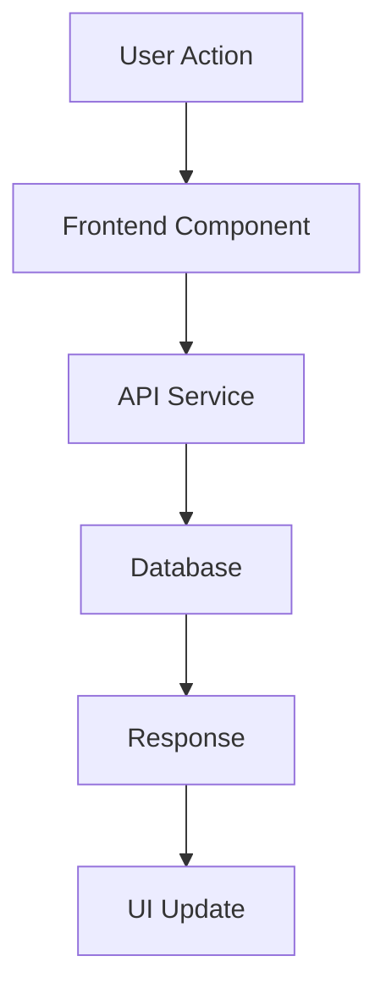

# Spec Template - [Feature Name]

## Overview

This template provides a standardized structure for creating feature specifications in the LusiLearn AI platform. Copy this template to create new specs and ensure consistency across all feature development.

## Template Structure

Each spec should contain three main files:
- `requirements.md` - User stories and acceptance criteria
- `design.md` - Technical architecture and design decisions  
- `tasks.md` - Implementation tasks and checklist

## Requirements Template

```markdown
# [Feature Name] - Requirements Document

## Introduction

[Brief description of the feature and its purpose in the LusiLearn AI platform]

## User Stories & Requirements

### Requirement 1: [Primary User Story]

**User Story:** As a [user type], I want [feature/capability], so that [benefit/outcome]

#### Acceptance Criteria

1. WHEN [trigger/condition] THEN [system] SHALL [expected behavior]
2. IF [precondition] THEN [system] SHALL [response]
3. GIVEN [context] WHEN [action] THEN [system] SHALL [result]

### Requirement 2: [Secondary User Story]

**User Story:** As a [user type], I want [feature/capability], so that [benefit/outcome]

#### Acceptance Criteria

1. WHEN [trigger/condition] THEN [system] SHALL [expected behavior]
2. WHEN [action] AND [condition] THEN [system] SHALL [response]

[Continue with additional requirements...]

## Non-Functional Requirements

### Performance Requirements
- Response time: [specific timing requirements]
- Throughput: [capacity requirements]
- Scalability: [growth expectations]

### Security Requirements
- Authentication: [auth requirements]
- Authorization: [permission requirements]
- Data protection: [privacy/security needs]

### Usability Requirements
- Accessibility: [WCAG compliance level]
- Browser support: [supported browsers/versions]
- Mobile responsiveness: [mobile requirements]

## Success Metrics

### User Metrics
- [Specific measurable user engagement metrics]
- [User satisfaction or adoption metrics]

### Technical Metrics
- [Performance benchmarks]
- [Reliability requirements]

### Business Metrics
- [Business impact measurements]
- [ROI or value metrics]
```

## Design Template

```markdown
# [Feature Name] - Design Document

## Overview

[High-level architectural overview of the feature]

## Architecture

### System Components

#### Frontend Components
- **Component 1**: [Purpose and responsibilities]
- **Component 2**: [Purpose and responsibilities]

#### Backend Services
- **Service 1**: [Purpose and API endpoints]
- **Service 2**: [Purpose and functionality]

#### Database Schema
- **Table 1**: [Purpose and key fields]
- **Table 2**: [Purpose and relationships]

### Data Flow



### API Design

#### Endpoints

**GET /api/v1/[resource]**
- Purpose: [What this endpoint does]
- Parameters: [Query parameters]
- Response: [Response format]

**POST /api/v1/[resource]**
- Purpose: [What this endpoint does]
- Body: [Request body format]
- Response: [Response format]

### Security Considerations

- **Authentication**: [How users are authenticated]
- **Authorization**: [Permission model]
- **Data Validation**: [Input validation strategy]
- **Rate Limiting**: [API rate limiting approach]

### Performance Considerations

- **Caching Strategy**: [What and how to cache]
- **Database Optimization**: [Indexing and query optimization]
- **Frontend Optimization**: [Bundle size, lazy loading, etc.]

### Error Handling

- **Client Errors**: [4xx error handling]
- **Server Errors**: [5xx error handling]
- **Validation Errors**: [Input validation error responses]

### Testing Strategy

#### Unit Testing
- [Components/functions to unit test]
- [Testing frameworks and tools]

#### Integration Testing
- [API endpoint testing]
- [Database integration testing]

#### End-to-End Testing
- [User journey testing]
- [Cross-browser testing]

## Technology Stack

### Frontend
- **Framework**: [React/Next.js version]
- **UI Library**: [Shadcn/ui, Tailwind CSS]
- **State Management**: [React Query, Zustand, etc.]

### Backend
- **Runtime**: [Node.js version]
- **Framework**: [Express.js, FastAPI]
- **Database**: [PostgreSQL, Redis]

### External Services
- **AI Services**: [OpenAI, custom models]
- **Third-party APIs**: [YouTube, Khan Academy, etc.]

## Deployment Considerations

- **Environment Variables**: [Required configuration]
- **Database Migrations**: [Schema changes needed]
- **Infrastructure**: [Scaling and deployment needs]
```

## Tasks Template

```markdown
# [Feature Name] - Implementation Plan

## Task Breakdown

### Phase 1: Foundation Setup

- [ ] 1. Set up project structure and core interfaces
  - Create directory structure for components and services
  - Define TypeScript interfaces and types
  - Set up basic routing and navigation
  - _Requirements: [Reference to specific requirements]_

- [ ] 2. Implement data models and validation
  - Create database schema and migrations
  - Implement data validation with Zod schemas
  - Set up repository pattern for data access
  - _Requirements: [Reference to specific requirements]_

### Phase 2: Core Functionality

- [ ] 3. Implement backend API services
  - Create REST API endpoints
  - Implement business logic in service layer
  - Add authentication and authorization
  - _Requirements: [Reference to specific requirements]_

- [ ] 4. Build frontend components
  - Create UI components with proper styling
  - Implement state management and data fetching
  - Add form handling and validation
  - _Requirements: [Reference to specific requirements]_

### Phase 3: Integration & Testing

- [ ] 5. Integrate frontend and backend
  - Connect UI components to API services
  - Implement error handling and loading states
  - Add real-time features if needed
  - _Requirements: [Reference to specific requirements]_

- [ ] 6. Implement testing suite
  - Write unit tests for components and services
  - Create integration tests for API endpoints
  - Add end-to-end tests for user journeys
  - _Requirements: [Reference to specific requirements]_

### Phase 4: Polish & Optimization

- [ ] 7. Performance optimization
  - Optimize database queries and indexing
  - Implement caching strategies
  - Optimize frontend bundle size and loading
  - _Requirements: [Reference to specific requirements]_

- [ ] 8. Security and accessibility
  - Implement security best practices
  - Add accessibility features and ARIA labels
  - Conduct security audit and testing
  - _Requirements: [Reference to specific requirements]_

## Definition of Done

### Code Quality
- [ ] All code follows TypeScript best practices
- [ ] ESLint and Prettier formatting applied
- [ ] Code review completed and approved
- [ ] No console errors or warnings

### Testing
- [ ] Unit test coverage > 80%
- [ ] All integration tests passing
- [ ] End-to-end tests covering main user flows
- [ ] Performance tests meeting requirements

### Documentation
- [ ] API documentation updated
- [ ] Component documentation added
- [ ] README files updated
- [ ] Deployment guide updated

### Deployment
- [ ] Feature deployed to staging environment
- [ ] User acceptance testing completed
- [ ] Performance monitoring in place
- [ ] Ready for production deployment

## Risk Assessment

### Technical Risks
- **Risk 1**: [Description and mitigation strategy]
- **Risk 2**: [Description and mitigation strategy]

### Timeline Risks
- **Risk 1**: [Description and contingency plan]
- **Risk 2**: [Description and contingency plan]

## Dependencies

### Internal Dependencies
- [Other features or components this depends on]
- [Database schema changes required]

### External Dependencies
- [Third-party services or APIs needed]
- [Library or framework updates required]

## Success Criteria

- [ ] All acceptance criteria met
- [ ] Performance requirements satisfied
- [ ] Security requirements implemented
- [ ] User feedback positive (if applicable)
- [ ] No critical bugs in production
```

## Usage Instructions

### Creating a New Spec

1. **Choose the appropriate priority directory**:
   - `high-priority/` for critical platform features
   - `medium-priority/` for enhancement features  
   - `low-priority/` for polish and optimization

2. **Create the spec directory**:
   ```bash
   mkdir -p .kiro/specs/{priority-level}/{feature-name}/
   ```

3. **Copy and customize the templates**:
   - Copy this template content to create `requirements.md`, `design.md`, and `tasks.md`
   - Replace all `[placeholder]` content with feature-specific information
   - Follow the EARS format for acceptance criteria
   - Ensure all requirements are testable and measurable

4. **Review and validate**:
   - Ensure requirements align with platform goals
   - Verify technical feasibility in design
   - Break down tasks into manageable chunks (1-3 days each)
   - Get stakeholder review and approval

### Best Practices

- **Requirements**: Focus on user value and business outcomes
- **Design**: Consider scalability, maintainability, and security
- **Tasks**: Make tasks specific, measurable, and time-bound
- **Testing**: Plan testing strategy from the beginning
- **Documentation**: Keep documentation up-to-date throughout development

### Quality Checklist

Before finalizing any spec, ensure:
- [ ] All user stories follow the standard format
- [ ] Acceptance criteria use EARS format (WHEN/IF/GIVEN)
- [ ] Design addresses all non-functional requirements
- [ ] Tasks are granular and properly estimated
- [ ] Dependencies are clearly identified
- [ ] Success metrics are defined and measurable
- [ ] Risk assessment is complete and realistic

---

*Use this template as a starting point for all new feature specifications. Customize as needed while maintaining consistency across the platform.*